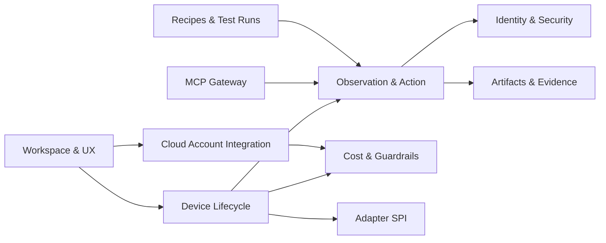

# Bounded Contexts
<!-- derived from: spec/spec.md (DeviceLab product section), idea.md §4 §7 §8 §12 -->

## Context map

## Context contracts

| Context | Owns | Does not own | Exposes | Consumes |
|---|---|---|---|---|
| `Workspace & UX` | local workspace settings, UI state projections, session lists | provisioning internals, cloud credentials | REST endpoints for dashboard/session views | lifecycle, cost, artifacts contexts |
| `Cloud Account Integration` | AWS connection records, preflight checks, bootstrap status | per-device runtime state | connect/validate/preflight operations | AWS IAM/STS/quotas, deployment context |
| `Device Lifecycle` | templates, profiles, devices, states/phases, warm pool slots | UI rendering, secret values | create/start/stop/snapshot/fork/terminate APIs | cloud integration, adapter SPI, cost |
| `Observation & Action` | screen versioning, observation cache, action envelopes, run-step batching | cloud resource ownership | semantic interaction APIs (`type_into`, `fill_form`, `wait_until`) | runtime agent streams, identity broker |
| `MCP Gateway` | client sessions, capability handshake, tool-group access control | device persistence | MCP tools and subscriptions | observation/action, lifecycle, artifacts |
| `Recipes & Test Runs` | recipe specs, run records, smoke/suite orchestration | low-level device transport | run/record/list recipe APIs | observation/action, artifacts |
| `Artifacts & Evidence` | files metadata, evidence records, replay indexes | pricing/account policy | artifact download and replay APIs | session events, test runs |
| `Identity & Security` | secret references, confirmation/audit events, redaction rules | business workflows | secret resolve/inject, audit event stream | OS keychain, MCP elicitation |
| `Cost & Guardrails` | pricing cache, workspace caps, orphan resource scans | rendering and user auth UI | cost summary, cap events, cleanup suggestions | AWS Pricing + tagged resource inventory |
| `Adapter SPI` | adapter registration/compat checks | queue orchestration and docs | plugin loading and capability declarations | lifecycle and observation contexts |

## Dependency rule

- UI/API entrypoints may orchestrate across contexts, but ownership boundaries remain strict.
- No context writes another context's canonical entities directly; interactions go through service contracts.
