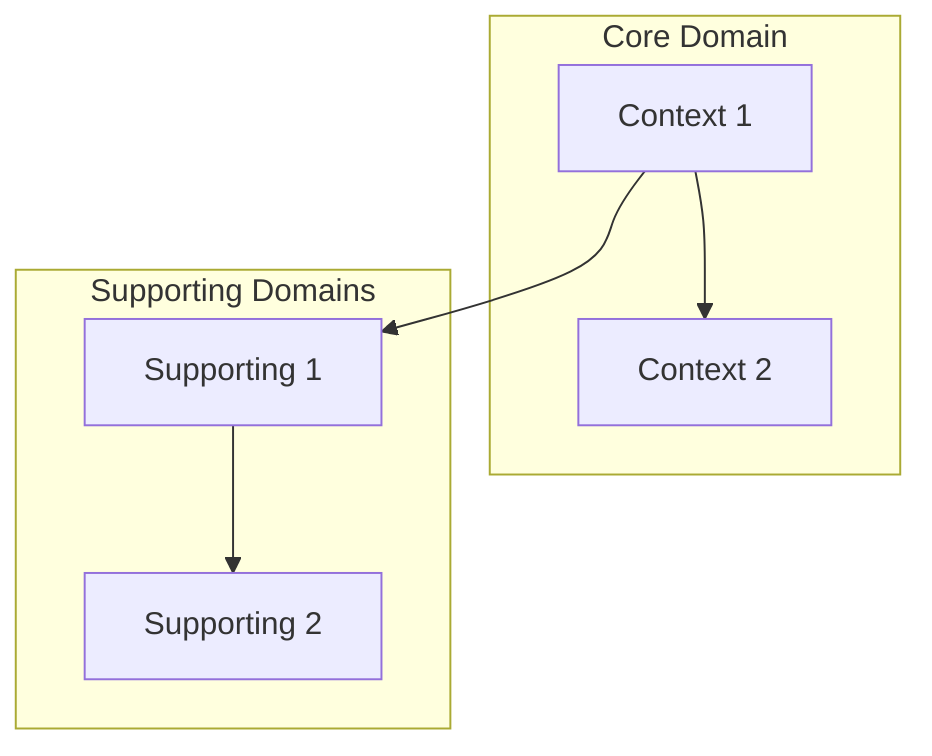

# Bounded Contexts
<!-- derived from: IDEA.md §8 — populated by repo_initialize -->

_[Product name]_ is organized into the following bounded contexts:

## Context list

| Context | Owns | Exposes | Consumes |
|---------|------|---------|----------|
| _[Context 1]_ | _[Entities]_ | _[APIs/events]_ | _[Other contexts]_ |
| _[Context 2]_ | _[Entities]_ | _[APIs/events]_ | _[Other contexts]_ |

## Context map

_[Replace with actual context map showing relationships between bounded contexts.]_

_[This section is populated by `skills/init/repo_initialize.md` during repository initialization.]_
