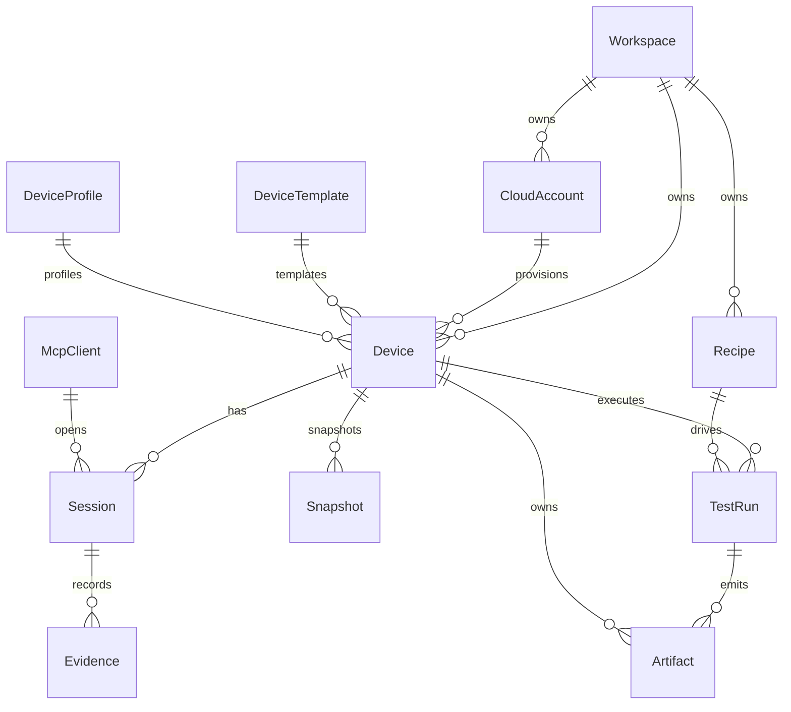

# Data Model
<!-- derived from: spec/spec.md (DeviceLab product section), idea.md §8 -->

## Core entities

| Entity | Primary key | Key fields | Relationships |
|---|---|---|---|
| `Workspace` | `id (uuid)` | `name`, `default_region`, `created_at` | 1:N `CloudAccount`, 1:N `Device`, 1:N `Recipe` |
| `CloudAccount` | `id (uuid)` | `provider`, `aws_account_id`, `credential_method`, `connection_status` | N:1 `Workspace`, 1:N `Device` |
| `DeviceTemplate` | `template_id (string)` | `platform_family`, `runtime_type`, `streaming_adapter`, `automation_adapter` | 1:N `Device`, 1:N `WarmPoolSlot` |
| `DeviceProfile` | `id (uuid)` | `name`, `instance_size`, `auto_stop_minutes`, `snapshot_policy` | 1:N `Device` |
| `Device` | `id (uuid)` | `name`, `state`, `phase`, `flags`, `region`, `tags` | N:1 `CloudAccount`, N:1 `DeviceTemplate`, N:1 `DeviceProfile`, 1:N `Session` |
| `Session` | `id (uuid)` | `client_type`, `client_id`, `lease_kind`, `started_at`, `ended_at` | N:1 `Device`, 1:N `Evidence` |
| `McpClient` | `id (uuid)` | `name`, `transport`, `allowed_tool_groups`, `last_seen_at` | 1:N `Session` |
| `Snapshot` | `id (uuid)` | `kind`, `status`, `progress`, `aws_snapshot_id`, `parent_snapshot_id` | N:1 `Device` |
| `Recipe` | `id (uuid)` | `name`, `version`, `family_compat`, `inputs_schema` | N:N `Device` via `TestRun` |
| `TestRun` | `id (uuid)` | `kind`, `status`, `report_format`, `mcp_session_id` | N:1 `Device`, N:1 `Recipe`, 1:N `Artifact` |
| `Artifact` | `id (uuid)` | `kind`, `path`, `checksum`, `size_bytes` | N:1 `Device` or N:1 `TestRun` |
| `Evidence` | `id (uuid)` | `tool_name`, `request_json`, `response_json`, `screen_version_before/after` | N:1 `Session` |
| `SecretRef` | `id (uuid)` | `name`, `backend`, `requires_elicitation` | Referenced by recipe/session inputs |
| `CostEstimate` | `id (uuid)` | `service_code`, `attributes_hash`, `hourly_usd`, `expires_at` | Scoped by cloud account + region |
| `AuditEvent` | `id (uuid)` | `actor`, `tool`, `confirmation_id`, `outcome`, `at` | Append-only, optional `device_id` foreign key |
| `WarmPoolSlot` | `id (uuid)` | `state`, `device_id`, `created_at` | N:1 `DeviceTemplate` |

## ER diagram (logical)

## Lifecycle and integrity notes

- `Device.state` is constrained to canonical lifecycle states; `phase` captures sub-step detail.
- Soft-delete applies to `Device`, `Snapshot`, and `Artifact`; audit records are immutable.
- `Evidence` and `AuditEvent` retention is time-based (default 30 days) with purge jobs.

## Indexing priorities

1. `Device(state, region, updated_at)` for active dashboard queries.
2. `Session(device_id, started_at desc)` for replay listing.
3. `Evidence(session_id, created_at desc)` for timeline playback.
4. `CostEstimate(service_code, attributes_hash, expires_at)` for pricing cache hits.
5. `AuditEvent(at desc, tool)` for incident review.
