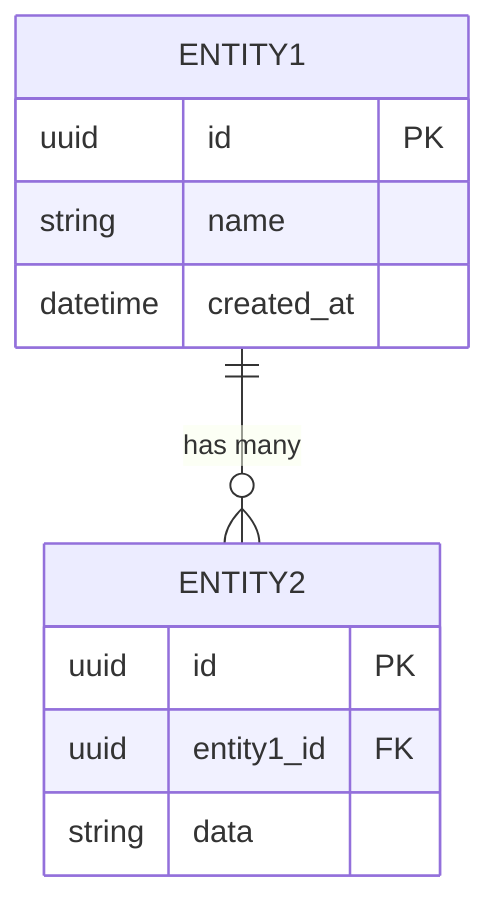

# Data Model
<!-- derived from: IDEA.md §8 — populated by repo_initialize -->

## Entity catalog

| Entity | Description | Key fields | Indexes |
|--------|-------------|------------|---------|
| _[Entity 1]_ | _[One sentence]_ | _[field1, field2]_ | _[primary, foreign]_ |
| _[Entity 2]_ | _[One sentence]_ | _[field1, field2]_ | _[primary, foreign]_ |

## Entity relationships

_[Replace with actual ER diagram showing entities, fields, and relationships.]_

## Key design notes

- _[Note 1: e.g., "Soft deletes implemented via deleted_at timestamp"]_
- _[Note 2: e.g., "UUID primary keys for all entities"]_

_[This section is populated by `skills/init/repo_initialize.md` during repository initialization.]_
