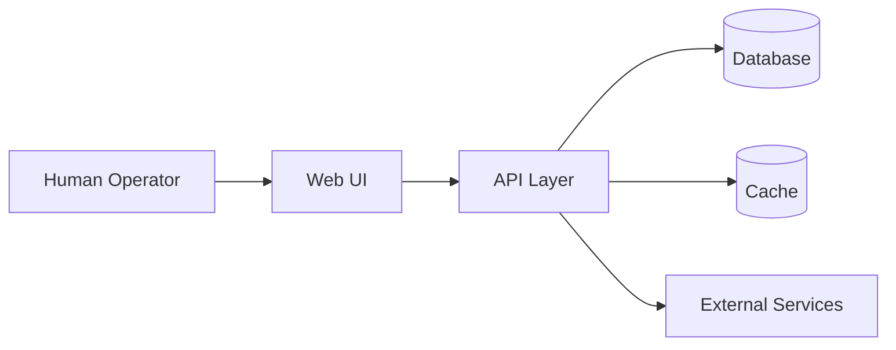

# System Overview
<!-- derived from: IDEA.md §1 §2 §3 §4 §7 — populated by repo_initialize -->

_[Product name]_ is a _[one-line description]_.

## Archetype

- _[e.g., SaaS multi-tenant web application]_
- _[e.g., CLI tool with cloud sync]_
- _[e.g., API service with async workers]_

## Component map

_[Replace with actual component diagram showing the major system pieces and their relationships.]_

## Primary data flows

1. _[Data flow 1: e.g., User authentication flow]_
2. _[Data flow 2: e.g., CRUD operations flow]_
3. _[Data flow 3: e.g., Background job processing]_

## Key design decisions

- _[Decision 1: e.g., "Modular monolith over microservices for v1" — why?]_
- _[Decision 2: e.g., "PostgreSQL over SQLite for multi-tenant needs" — why?]_
- _[Decision 3: e.g., "REST over GraphQL for simpler client integration" — why?]_

_[This section is populated by `skills/init/repo_initialize.md` during repository initialization.]_
