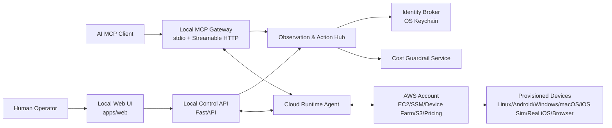

# System Overview
<!-- derived from: spec/spec.md (DeviceLab product section), idea.md §1 §2 §3 §4 §7 -->

DeviceLab is a local-first, open-source BYOC cloud device platform. It runs on a developer machine, connects to the user's AWS account, and exposes cloud-backed device families to both humans (web UI) and AI agents (MCP).

## Archetype

- Local control plane + cloud execution plane.
- Documentation-first, queue-first delivery model.
- AI-first operation surface (MCP) with human UI parity.

## Component map

## Primary data flows

1. **Onboarding:** UI runs account preflight, then API provisions first Linux device via runtime agent and AWS control APIs.
2. **Human session:** UI opens stream endpoint, receives WebRTC media, and sends interaction intents through the action hub.
3. **AI session:** MCP client calls capability-aware tools; observation returns structured trees/indexes first, with screenshot/VLM escalation gated.
4. **Cost control:** background pollers fetch pricing data and active-resource state, emitting soft/hard cap events.
5. **Evidence and replay:** each MCP action stores before/after observation snapshots and envelope payloads for replay/audit.

## Key design decisions

- **Structured observation first:** AX/OCR index is default; screenshots and VLM are escalation tiers.
- **Low round-trip contract:** action envelopes include screen-version guards and wait conditions to reduce chatty loops.
- **BYOC hard boundary:** no DeviceLab-hosted SaaS or billing plane.
- **No secret exposure to AI:** secret refs resolve via Identity Broker and never appear in model context.
- **Capability handshake required:** tool manifests are filtered per device family, profile, and permission mode.
